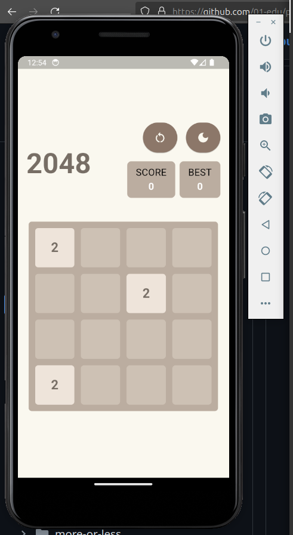
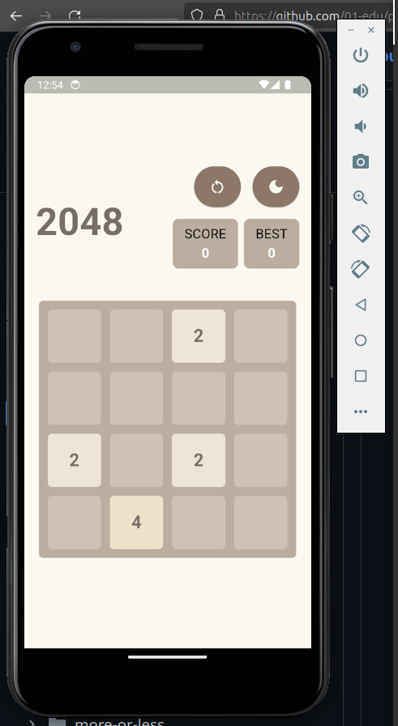
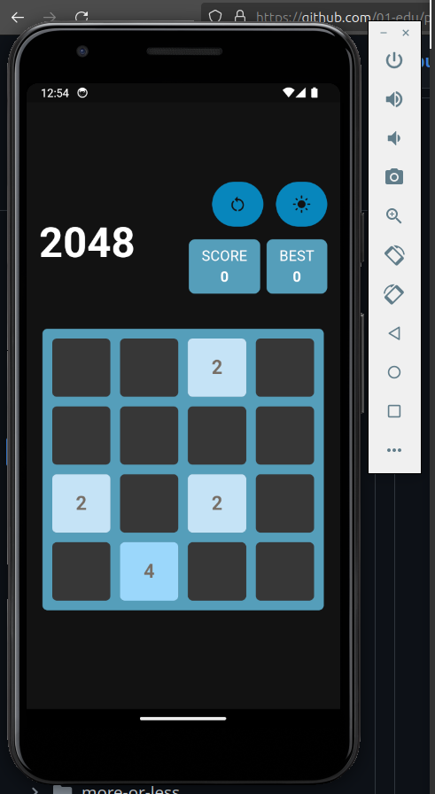
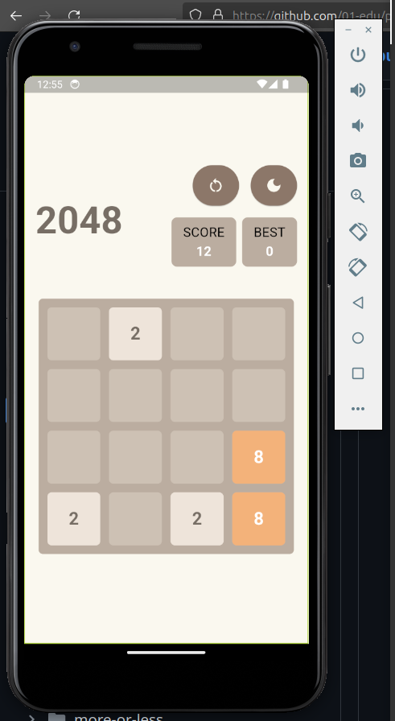
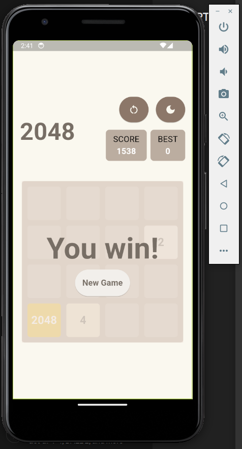
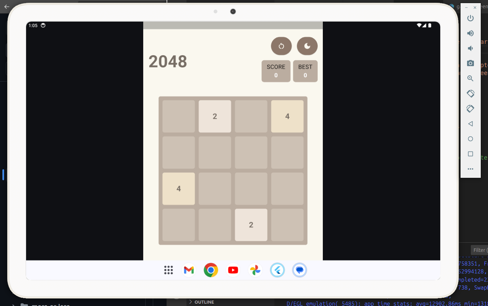
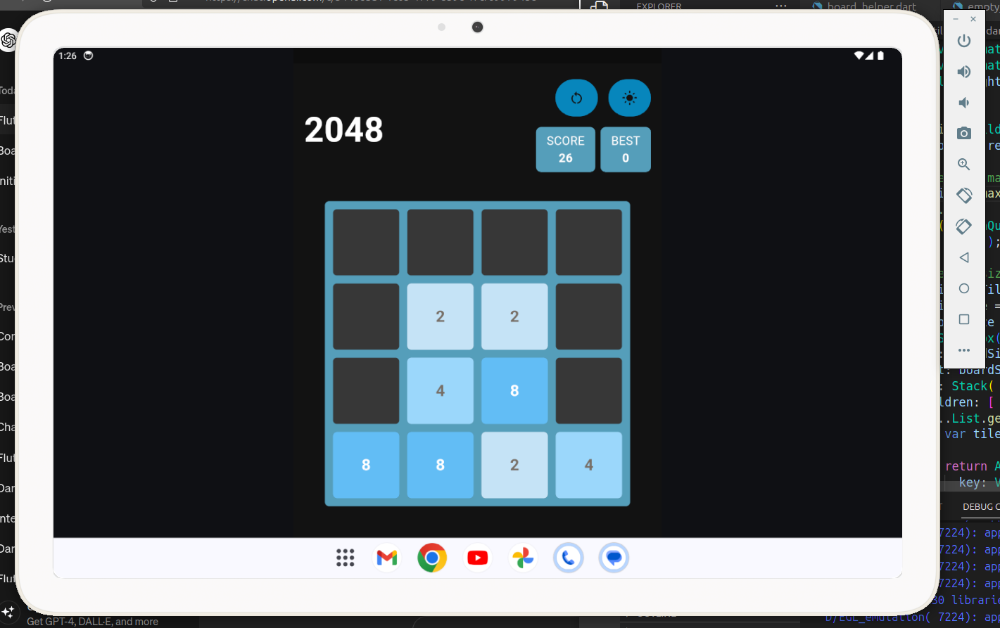

# Twenty-forty-eight

It is April 2014, and the popular game "2048" has not yet been released. Your task is to implement the game before the official release. The objective of the game is to slide numbered tiles on a grid to combine them and create a tile with the number 2048.







### Instructions

To complete this exercise, you will need to do the following:

- Create the 4x4 grid and fill it with `tiles` valued at either 2 or 4.
- The game must start with 3-4 `tiles` randomly placed on the board.
- Implement the ability for players to swipe the `tiles` in any of the four directions and have them move as far as possible in the chosen direction.
- Use [animation](https://docs.flutter.dev/development/ui/widgets/animation) to smoothly move the `tiles`. You are free to choose the colors for the `tiles`.
- If two `tiles` with the same value collide, they should merge into one tile with twice the value, and the score must be updated accordingly.
- After each move, a new `tile` must appear randomly in an empty slot on the board.
- The game ends when no legal moves are possible (i.e., the grid is full, and no adjacent `tiles` have the same value).
- You must add a `restart` button so that the player can restart the game and try to achieve a higher score.
- Include functionality to track and display the `current` and `best scores` live during gameplay.
- Update the `best score` if necessary when the game is over.

Remember to follow best practices for coding and game development, and be sure to document your code and any decisions made during the development process.

## **How to audit project**

### <ins>Easy reveiw of the app in work</ins>

  Follow [the link to whatch the video of some parts of the game process](https://youtu.be/gi-RDDVY8bg)

### <ins>To start it manually you need</ins>

  - [instulled Android Studio (to emulate the devise)](https://docs.flutter.dev/tools/android-studio)
  - [make sure you have Flutter and dart instulled](https://docs.flutter.dev/get-started/install)
  - clone the repository 
    ```bash
    git clone https://01.kood.tech/git/aivanenk/twenty-forty-eight.git
    ```
  - in app directory run
    ```bash
    flutter pub get
    ```
  - to run application
    ```bash
    flutter run
    ```
  - or press the debug button for **main.dart** (in Visual Studio Code)


## Bonus

Some extra features:

- You can use buttons for moving the `tiles`.
- Design a user interface (UI) for the game displaying scores.
- Ensure the game is responsive and supports different devices.




